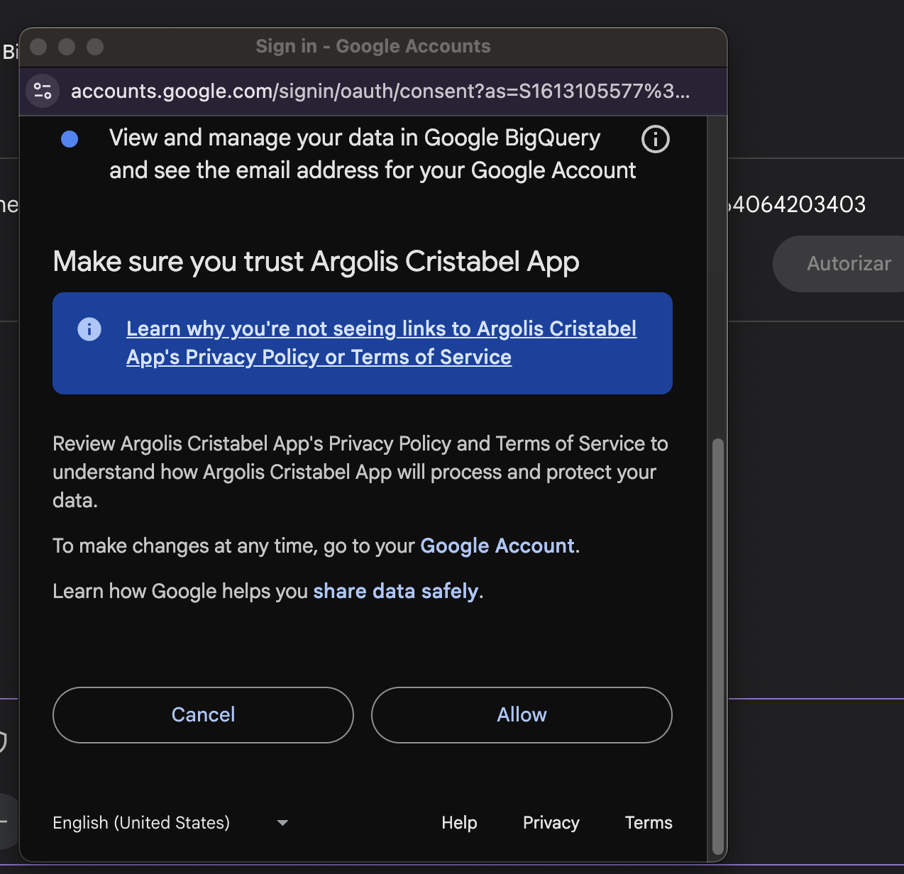
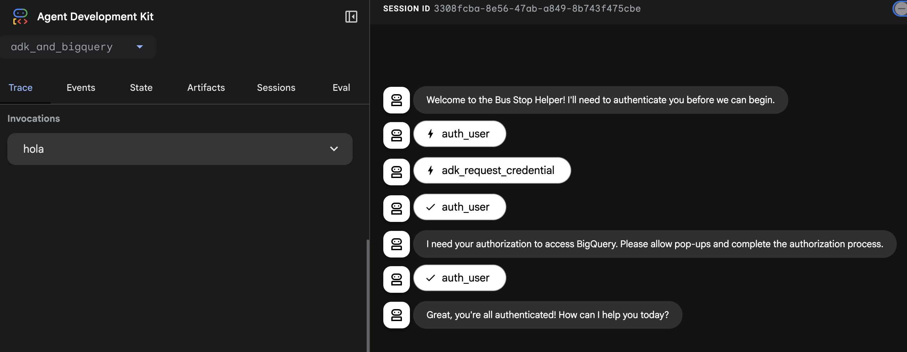
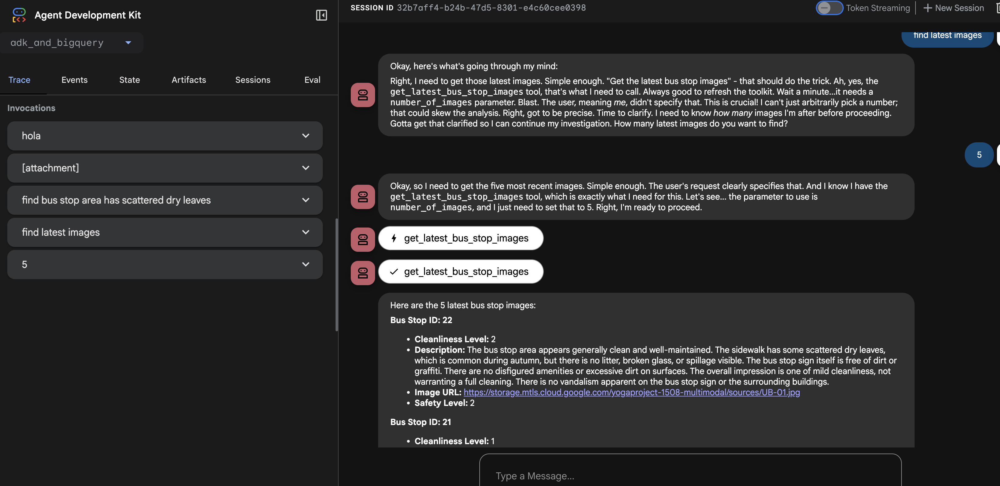
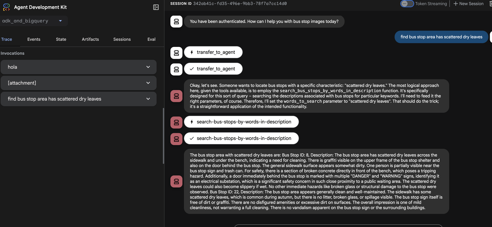
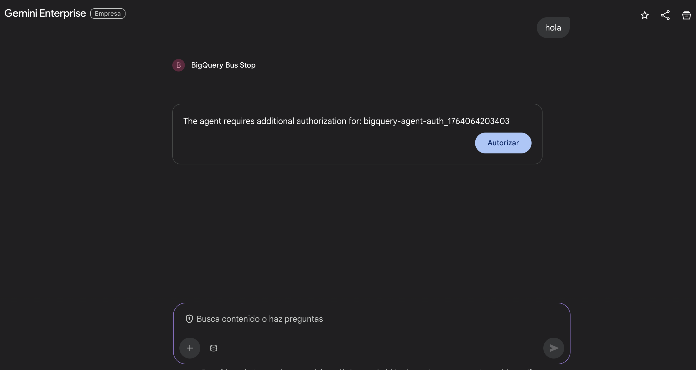
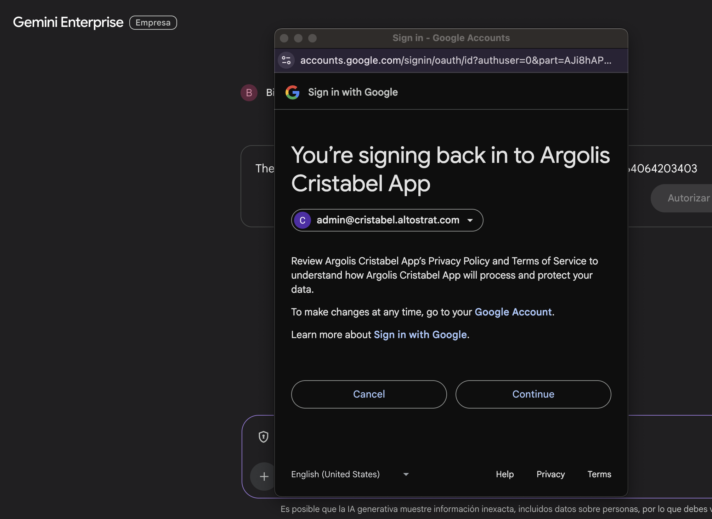
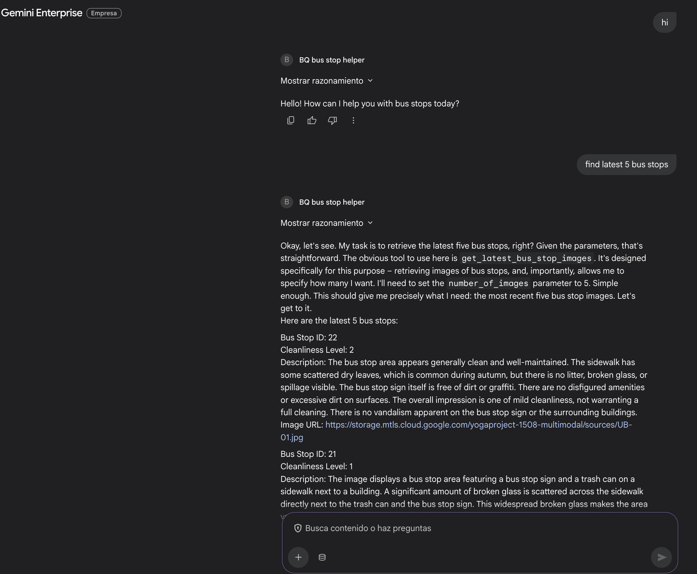

# BigQuery Bus Stop Images MCP Agent

This repository contains a sample for an ADK agent designed to interact with a BigQuery dataset containing bus stop images using the Model Context Protocol (MCP) and Authentication enabled. 
Also this guide will provide a walkthrough to deploy your agent to Agent Engine and you will also learn how to register your deployed agent with Gemini Enterprise with Authentication enabled to make it discoverable and usable by other agents.

## Overview

The agent provides tools to:
-   Search for bus stops by description using BigQuery SQL.
-   Perform conversational data analysis on the dataset.
-   Retrieve metadata about datasets and tables.

## Prerequisites

-   **Toolbox Executable**: The `toolbox` binary must be present in this directory and have execution permissions.
    ```bash
    chmod +x toolbox
    ```
-   **Google Cloud Credentials**: You need valid Google Cloud credentials to access the BigQuery datasets.
    ```bash
    gcloud auth application-default login
    ```

## Configuration

### Environment Variables

The `mcp.yaml` configuration file relies on the following environment variables. You must set these before running the agent:

-   `BIGQUERY_RUN_PROJECT_ID`: The Google Cloud Project ID where the BigQuery jobs will run.
-   `BIGQUERY_DATA_LOCATION`: The location of your BigQuery data (e.g., `US`, `EU`).
-   `BIGQUERY_DATA_PROJECT_ID`: The Google Cloud Project ID where the data resides (specifically for the `search-bus-stops-by-words-in-description` tool).

### MCP Configuration (`mcp.yaml`)

The `mcp.yaml` file defines the agent's capabilities. It includes:
-   **Source**: Defines the BigQuery connection.
-   **Tools**:
    -   `search-bus-stops-by-words-in-description`: Executes a SQL query to find bus stops.
    -   `ask-data-insights`: Uses Conversation Analytics API.
    -   `get-dataset-information`, `list-tables`, `get-table-information`: Metadata tools.

## Usage

To start the MCP agent, run the following command:

```bash
./toolbox --tools-file mcp.yaml
```

### Optional Flags

-   `--port <int>`: Specify the port the server will listen on (default: 5000).
-   `--log-level <level>`: Set logging level (DEBUG, INFO, WARN, ERROR).
-   `--ui`: Launch the Toolbox UI web server.

Example with options:

```bash
./toolbox --tools-file mcp.yaml --port 8080 --log-level DEBUG
```

The agent and BQ tools are based on:
https://github.com/GoogleCloudPlatform/data-to-ai/blob/main/labs/agents/ADK-and-BigQuery.md

## Local Authentication Flow

The agent uses OAuth2 to authenticate users and authorize access to BigQuery.

1.  **Initial Request**: When the user asks a question requiring BigQuery access, the agent checks for existing credentials.
2.  **OAuth Flow**: The user follows the link to Google's OAuth consent screen.
    
3.  **Token Exchange**: After approval, the agent receives an authorization code, exchanges it for an access token, and stores it in the session state.
    

## Agent Capabilities

The agent can query BigQuery to find bus stop images and information.



It can also use the MCP toolset to perform more complex queries.



## Testing Locally with Cloud Run Proxy

To test the agent locally while connecting to the MCP server running in Cloud Run:

1.  **Start the Proxy**:
    ```bash
    gcloud run services proxy toolbox --region=us-central1
    ```

2.  **Verify Token and Tool Access**:
    You can verify your token is valid and the tool is accessible by running the following `curl` command. Replace `TOKEN` with your actual access token.

    ```bash
    curl -X POST http://127.0.0.1:8080/mcp/bus-stop-images-toolset \
    -H "Authorization: Bearer TOKEN" \
    -H "Content-Type: application/json" \
    -d '{
      "jsonrpc": "2.0",
      "method": "tools/call",
      "params": {
        "name": "search-bus-stops-by-words-in-description",
        "arguments": {
          "words_to_search": "scattered dry leaves"
        }
      },
      "id": 1
    }'
    ```
# Deploy to Agent Engine and Gemini Enterprise

## Deploy to Agent Engine

To deploy the agent to Agent Engine, run the following command:
```bash
  ./deployment/create_agent.sh
```

## Register on Gemini Enterprise

Then you can register the agent with Gemini Enterprise:
```bash
  ./deployment/register_agent.sh
```
## Authentication Flow - Gemini Enterprise to Agent Engine

The agent uses OAuth2 to authenticate users and authorize access to BigQuery.

1.  **Authorization Prompt**: If no valid credentials exist, the agent prompts the user to authorize access.
    


2.  **OAuth Flow**: The user follows the link to Google's OAuth consent screen.
    


3.  **Query Results**: The agent uses the access token to query BigQuery and returns the results to the user.
    
